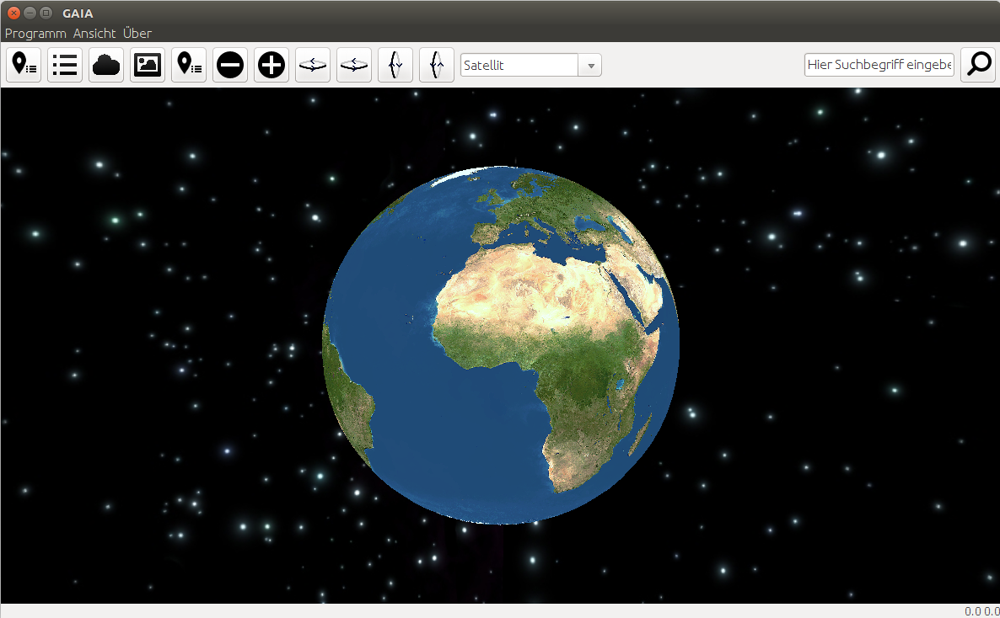
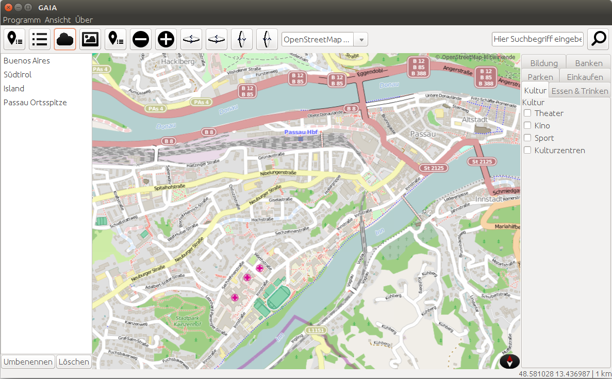
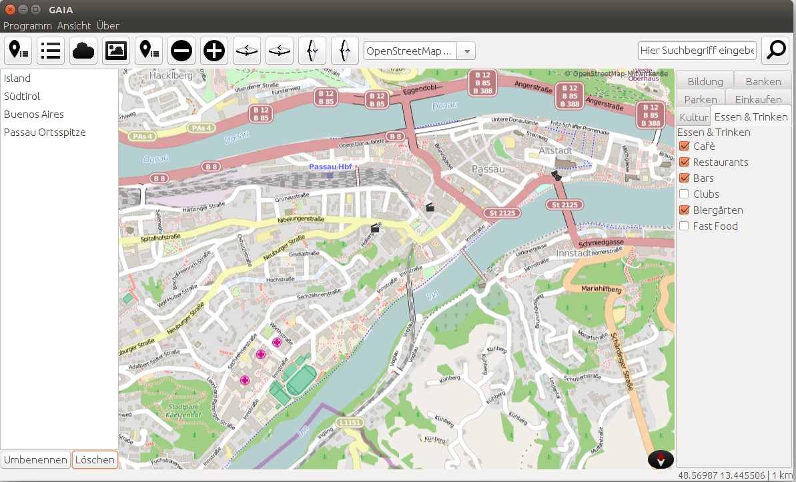

# GAIA
GAIA was developed during the software engineering lab at the University of Passau by 5 students.
GAIA is showing the whole world in the 3d mode and after zooming in, the world can be discovered with maps from the OpenStreetMap Project (http://www.openstreetmap.org/#map=5/51.500/-0.100).
It is possible to search for locations , set markers on visited locations, select points of interests from various categories and to see the current weather information for the visited locations. The screenshot function enables the user to extract certain areas with the select additional informations.

The rendering of the map tiles was down with the Java OpenGL (JOGL) binding and the application was written in Java with the Swing library.
The APIs used for collecting the additional informations are:
* the Overpass API for collecting points of interests (http://wiki.openstreetmap.org/wiki/Overpass_API)
* Nominatim API for searching for locations (http://www.nominatim.org/)
* Weather data comes from the OpenWeatherMap Project (http://openweathermap.org/)

